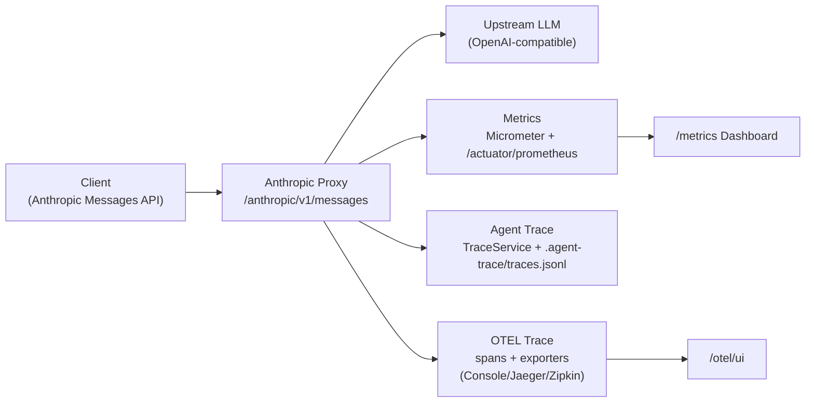
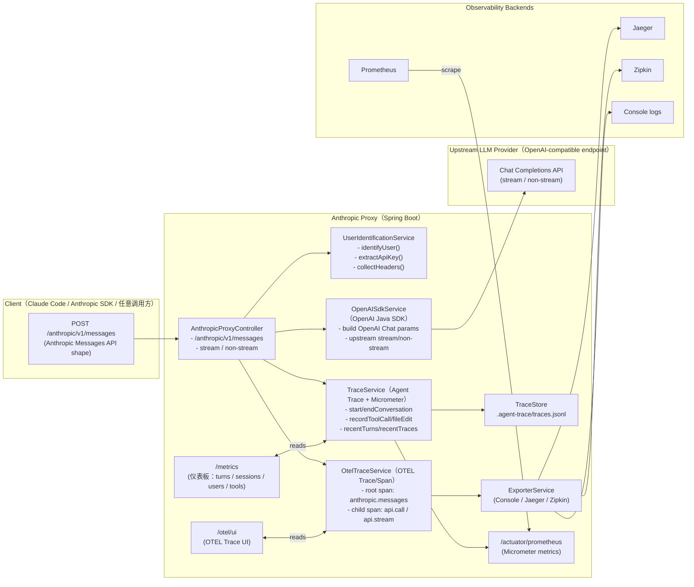

# Agent Trace poc for Claude Code

<div align="center">


**Anthropic API 代理服务，将 Anthropic API 请求转换为 OpenAI 格式，并提供监控指标和可视化仪表板。**

</div>

## 一图看懂



## 目录

- [功能特性](#功能特性)
- [快速开始](#快速开始)
- [配置说明](#配置说明)
- [API 使用](#api-使用)
- [监控指标](#监控指标)
- [Docker 部署](#docker-部署)
- [项目结构](#项目结构)
- [技术栈](#技术栈)
- [许可证](#许可证)

## 功能特性

- **API 代理**：将 Anthropic Messages API 请求转换为 OpenAI Chat Completions 格式
- **流式支持**：完整的流式响应支持（Server-Sent Events）
- **工具调用**：支持 Anthropic 工具（Tools/Function Calling）
- **用户识别**：多种用户识别方式（API Key、Header、IP）
- **指标监控**：Prometheus 集成 + 可视化仪表板
- **会话跟踪**：细粒度的 Session/Turn/Message 级别指标跟踪
- **工具调用详情**：记录每次工具调用的参数、耗时和代码修改行数
- **响应式架构**：基于 Spring WebFlux 的非阻塞架构
- **OpenTelemetry 集成**：完整的分布式追踪支持，兼容 Jaeger、Zipkin 等监控工具

## 架构图（拦截 Anthropic 请求 + Metrics / Agent Trace）



## 快速开始

### 环境要求

- Java 17+
- Maven 3.6+

### 构建

```bash
mvn clean package -DskipTests
```

### 运行

```bash
# 设置 API Key
export OPENAI_API_KEY=your_api_key

# 启动服务
java -jar target/anthropic-proxy-1.0.0-SNAPSHOT.jar
```

服务将在 `http://localhost:8080` 启动。

## 配置说明

在 `src/main/resources/application.yml` 中配置：

```yaml
server:
  port: 8080

proxy:
  openai:
    base-url: https://api.anthropic.com/v1  # OpenAI 兼容端点
    api-key: ${OPENAI_API_KEY:}             # API 密钥
    timeout: 300000                          # 超时时间（毫秒）

management:
  endpoints:
    web:
      exposure:
        include: health,info,prometheus,metrics
```

### 环境变量

| 变量 | 说明 | 是否必需 |
|----------|-------------|----------|
| `OPENAI_API_KEY` | Anthropic API 密钥 | 是 |
| `SERVER_PORT` | 服务器端口（默认：8080） | 否 |

## API 使用

### 发送消息

```bash
curl -X POST http://localhost:8080/anthropic/v1/messages \
  -H "Content-Type: application/json" \
  -H "x-api-key: your_api_key" \
  -d '{
    "model": "claude-sonnet-4-20250514",
    "max_tokens": 1024,
    "messages": [
      {"role": "user", "content": "Hello, Claude!"}
    ]
  }'
```

### 流式请求

```bash
curl -X POST http://localhost:8080/anthropic/v1/messages \
  -H "Content-Type: application/json" \
  -H "x-api-key: your_api_key" \
  -H "anthropic-beta: prompt-caching-1" \
  -d '{
    "model": "claude-sonnet-4-20250514",
    "max_tokens": 1024,
    "stream": true,
    "messages": [
      {"role": "user", "content": "Tell me a story about AI."}
    ]
  }'
```

### 健康检查

```bash
curl http://localhost:8080/anthropic/health
```

## 监控指标

### OpenTelemetry 追踪

访问 OpenTelemetry API 端点查看分布式追踪：

```bash
# 获取最近的追踪
curl http://localhost:8080/otel/traces?limit=50

# 获取特定追踪详情
curl http://localhost:8080/otel/traces/{traceId}

# 导出追踪到 Jaeger/Zipkin
curl -X POST http://localhost:8080/otel/traces/{traceId}/export

# 查看导出器状态
curl http://localhost:8080/otel/exporters
```

支持的导出器：
- **Console**: 输出到控制台日志（默认启用）
- **Jaeger**: 导出到 Jaeger（需配置）
- **Zipkin**: 导出到 Zipkin（需配置）

详细配置请参考 [OTEL_INTEGRATION.md](./OTEL_INTEGRATION.md)

### 仪表板

访问 `http://localhost:8080/dashboard` 查看可视化监控仪表板，包含以下标签页：

- **Messages (Turns)**：查看每条消息的详情，包括工具调用、延迟和 token 使用情况
- **Sessions**：用户会话概览，包含累计指标和平均值
- **Users**：用户级别的指标统计
- **Tool Distribution**：工具调用分布图表

### API 端点

| 端点 | 说明 |
|----------|-------------|
| `GET /metrics/api/turns` | 获取最近的 Turn 列表 |
| `GET /metrics/api/turns/{turnId}` | 获取特定 Turn 的详情 |
| `GET /metrics/api/sessions` | 获取活跃会话列表 |
| `GET /metrics/api/sessions/{sessionId}` | 获取会话详情 |
| `GET /metrics/api/sessions/{sessionId}/turns` | 获取会话中的所有消息 |
| `GET /metrics/api/users/{userId}/turns` | 获取用户的所有消息 |
| `GET /metrics/api/users/{userId}/sessions` | 获取用户的所有会话 |
| `GET /actuator/prometheus` | Prometheus 指标端点 |

### Prometheus 指标

```bash
curl http://localhost:8080/actuator/prometheus
```

关键指标：
- `claude_code.requests.total` - 总请求数
- `claude_code.requests.by_model` - 按模型分类的请求数
- `claude_code.tool_calls.total` - 总工具调用数
- `claude_code.tool_calls.by_name` - 按名称分类的工具调用数
- `claude_code.edit_tool_calls.total` - 编辑工具调用数
- `claude_code.lines_modified.total` - 总修改行数

## Docker 部署

```bash
# 构建镜像
docker build -t anthropic-proxy .

# 运行容器
docker run -d \
  -p 8080:8080 \
  -e OPENAI_API_KEY=your_api_key \
  --name anthropic-proxy \
  anthropic-proxy
```

## 项目结构

```
anthropic-proxy-java/
├── src/main/java/com/phodal/anthropicproxy/
│   ├── AnthropicProxyApplication.java    # 应用程序入口
│   ├── config/
│   │   ├── JacksonConfig.java            # JSON 配置
│   │   └── WebConfig.java                # Web 配置
│   ├── controller/
│   │   ├── AnthropicProxyController.java # API 控制器
│   │   └── MetricsDashboardController.java # 仪表板控制器
│   ├── model/
│   │   ├── anthropic/                    # Anthropic API 模型
│   │   ├── openai/                       # OpenAI API 模型
│   │   └── metrics/                      # 指标模型
│   │       ├── SessionInfo.java          # 会话信息
│   │       ├── TurnLog.java              # Turn/Message 级别指标
│   │       └── ToolCallLog.java          # 工具调用详情
│   └── service/
│       ├── MetricsService.java           # 指标服务
│       ├── OpenAISdkService.java         # OpenAI SDK 服务
│       ├── SessionManager.java           # 会话管理
│       └── UserIdentificationService.java # 用户识别服务
├── src/main/resources/
│   ├── application.yml                   # 应用程序配置
│   └── templates/
│       └── dashboard.html                # 仪表板 UI
└── pom.xml
```

## 技术栈

- Spring Boot 3.3.7
- Spring WebFlux
- OpenAI Java SDK 4.16.1
- Micrometer Prometheus
- Thymeleaf
- Lombok

## OTEL Related resources

[Claude Code Docs - Monitoring](https://code.claude.com/docs/en/monitoring-usage)

```bash
# 1. Enable telemetry
export CLAUDE_CODE_ENABLE_TELEMETRY=1

# 2. Choose exporters (both are optional - configure only what you need)
export OTEL_METRICS_EXPORTER=otlp       # Options: otlp, prometheus, console
export OTEL_LOGS_EXPORTER=otlp          # Options: otlp, console

# 3. Configure OTLP endpoint (for OTLP exporter)
export OTEL_EXPORTER_OTLP_PROTOCOL=grpc
export OTEL_EXPORTER_OTLP_ENDPOINT=http://localhost:4317

# 4. Set authentication (if required)
export OTEL_EXPORTER_OTLP_HEADERS="Authorization=Bearer your-token"

# 5. For debugging: reduce export intervals
export OTEL_METRIC_EXPORT_INTERVAL=10000  # 10 seconds (default: 60000ms)
export OTEL_LOGS_EXPORT_INTERVAL=5000     # 5 seconds (default: 5000ms)

# 6. Run Claude Code
claude
```

[Bringing Observability to Claude Code: OpenTelemetry in Action](https://signoz.io/blog/claude-code-monitoring-with-opentelemetry/)

- Total token usage & cost → How much are we spending, and where are those tokens going?
- Sessions, conversations & requests per user → Who’s using Claude regularly, and what does “active usage” really look like?
- Quota visibility → How close are we to hitting limits (like the 5-hour quota), and do we need to adjust capacity?
- Performance trends → From command duration over time to request success rate, are developers getting fast, reliable responses?
- Behavior insights → Which terminals are people using (VS Code, Apple Terminal, etc.), how are decisions distributed (accept vs. reject), and what tool types are most popular?
- Model distribution → Which Claude variants (Sonnet, Opus, etc.) are driving the most activity?

## 许可证

MIT
