# Agent Trace poc for Claude Code

<div align="center">


**Anthropic API 代理服务，将 Anthropic API 请求转换为 OpenAI 格式，并提供监控指标和可视化仪表板。**

</div>

## 一图看懂


## 目录

- [功能特性](#功能特性)
- [快速开始](#快速开始)
- [配置说明](#配置说明)
- [API 使用](#api-使用)
- [监控指标](#监控指标)
- [Docker 部署](#docker-部署)
- [项目结构](#项目结构)
- [技术栈](#技术栈)
- [许可证](#许可证)

## 功能特性

- **API 代理**：将 Anthropic Messages API 请求转换为 OpenAI Chat Completions 格式
- **流式支持**：完整的流式响应支持（Server-Sent Events）
- **工具调用**：支持 Anthropic 工具（Tools/Function Calling）
- **用户识别**：多种用户识别方式（API Key、Header、IP）
- **指标监控**：Prometheus 集成 + 可视化仪表板
- **会话跟踪**：细粒度的 Session/Turn/Message 级别指标跟踪
- **工具调用详情**：记录每次工具调用的参数、耗时和代码修改行数
- **响应式架构**：基于 Spring WebFlux 的非阻塞架构
- **OpenTelemetry 集成**：完整的分布式追踪支持，兼容 Jaeger、Zipkin 等监控工具
- **使用量日志**：自动记录每次请求的 Token 使用量（promptTokens/completionTokens）

## 架构图（拦截 Anthropic 请求 + Metrics / Agent Trace）

```mermaid
flowchart LR
  %% ========== Client ==========
  subgraph Client["Client（Claude Code / Anthropic SDK / 任意调用方）"]
    C["POST /anthropic/v1/messages<br/>(Anthropic Messages API shape)"]
  end

  %% ========== Proxy ==========
  subgraph Proxy["Anthropic Proxy（Spring Boot）"]
    AC["AnthropicProxyController<br/>- /anthropic/v1/messages<br/>- stream / non-stream"]
    UID["UserIdentificationService<br/>- identifyUser()<br/>- extractApiKey()<br/>- collectHeaders()"]
    SDK["OpenAISdkService（OpenAI Java SDK）<br/>- build OpenAI Chat params<br/>- upstream stream/non-stream"]

    TS["TraceService（Agent Trace + Micrometer）<br/>- start/endConversation<br/>- recordToolCall/fileEdit<br/>- recentTurns/recentTraces"]
    Store["TraceStore<br/>.agent-trace/traces.jsonl"]

    OT["OtelTraceService（OTEL Trace/Span）<br/>- root span: anthropic.messages<br/>- child span: api.call / api.stream"]
    EX["ExporterService<br/>(Console / Jaeger / Zipkin)"]

    Act["/actuator/prometheus<br/>(Micrometer metrics)"]
    Dash["/metrics<br/>(仪表板：turns / sessions / users / tools)"]
    OUI["/otel/ui<br/>(OTEL Trace UI)"]
  end

  %% ========== Upstream ==========
  subgraph Upstream["Upstream LLM Provider（OpenAI-compatible endpoint）"]
    U["Chat Completions API<br/>(stream / non-stream)"]
  end

  %% ========== Backends ==========
  subgraph Obs["Observability Backends"]
    Prom["Prometheus"]
    Jaeger["Jaeger"]
    Zipkin["Zipkin"]
    Console["Console logs"]
  end

  %% ========== Main request flow ==========
  C --> AC
  AC --> UID
  AC --> TS
  AC --> OT
  AC --> SDK
  SDK --> U

  %% ========== Agent Trace persistence ==========
  TS --> Store

  %% ========== OTEL export ==========
  OT --> EX
  EX --> Jaeger
  EX --> Zipkin
  EX --> Console

  %% ========== Metrics + dashboards ==========
  TS --> Act
  Prom -- "scrape" --> Act
  Dash <-- "reads" --> TS
  OUI <-- "reads" --> OT
```



## 快速开始

### 环境要求

- Java 17+
- Maven 3.6+

### 构建

```bash
mvn clean package -DskipTests
```

### 运行

```bash
# 设置 API Key
export OPENAI_API_KEY=your_api_key

# 启动服务
java -jar target/anthropic-proxy-1.0.0-SNAPSHOT.jar
```

服务将在 `http://localhost:8080` 启动。

## 配置说明

在 `src/main/resources/application.yml` 中配置：

```yaml
server:
  port: 8080

proxy:
  openai:
    base-url: https://api.anthropic.com/v1  # OpenAI 兼容端点
    api-key: ${OPENAI_API_KEY:}             # API 密钥
    timeout: 300000                          # 超时时间（毫秒）

management:
  endpoints:
    web:
      exposure:
        include: health,info,prometheus,metrics
```

### 环境变量

| 变量 | 说明 | 是否必需 |
|----------|-------------|----------|
| `OPENAI_API_KEY` | Anthropic API 密钥 | 是 |
| `SERVER_PORT` | 服务器端口（默认：8080） | 否 |

## API 使用

### 发送消息

```bash
curl -X POST http://localhost:8080/anthropic/v1/messages \
  -H "Content-Type: application/json" \
  -H "x-api-key: your_api_key" \
  -d '{
    "model": "claude-sonnet-4-20250514",
    "max_tokens": 1024,
    "messages": [
      {"role": "user", "content": "Hello, Claude!"}
    ]
  }'
```

### 流式请求

```bash
curl -X POST http://localhost:8080/anthropic/v1/messages \
  -H "Content-Type: application/json" \
  -H "x-api-key: your_api_key" \
  -H "anthropic-beta: prompt-caching-1" \
  -d '{
    "model": "claude-sonnet-4-20250514",
    "max_tokens": 1024,
    "stream": true,
    "messages": [
      {"role": "user", "content": "Tell me a story about AI."}
    ]
  }'
```

### 健康检查

```bash
curl http://localhost:8080/anthropic/health
```

## 监控指标

### OpenTelemetry 追踪

访问 OpenTelemetry API 端点查看分布式追踪：

```bash
# 获取最近的追踪
curl http://localhost:8080/otel/traces?limit=50

# 获取特定追踪详情
curl http://localhost:8080/otel/traces/{traceId}

# 导出追踪到 Jaeger/Zipkin
curl -X POST http://localhost:8080/otel/traces/{traceId}/export

# 查看导出器状态
curl http://localhost:8080/otel/exporters
```

支持的导出器：
- **Console**: 输出到控制台日志（默认启用）
- **Jaeger**: 导出到 Jaeger（需配置）
- **Zipkin**: 导出到 Zipkin（需配置）

详细配置请参考 [OTEL_INTEGRATION.md](./OTEL_INTEGRATION.md)

### 仪表板

访问 `http://localhost:8080/metrics` 查看可视化监控仪表板，包含以下标签页：

- **Messages (Turns)**：查看每条消息的详情，包括工具调用、延迟和 token 使用情况
- **Sessions**：用户会话概览，包含累计指标和平均值
- **Users**：用户级别的指标统计
- **Tool Distribution**：工具调用分布图表

### API 端点

| 端点                                            | 说明              |
|-----------------------------------------------|-----------------|
| `GET /metrics/api/summary`                    | 获取聚合指标摘要（requests/tool_calls/lines/tokens 等） |
| `GET /metrics/api/turns`                      | 获取最近的 Turns（所有会话，包含无文件编辑的请求） |
| `GET /metrics/api/turns/{turnId}`             | 获取特定 Turn 的详情（兼容旧 UI：traceId 或 conversationId） |
| `GET /metrics/api/sessions`                   | 获取 Sessions（按 user + clientSessionId 或 30min idle gap 聚合） |
| `GET /metrics/api/sessions/{sessionId}/turns` | 获取指定 Session 内的 Turns |
| `GET /metrics/api/traces`                     | 获取最近的 Agent Trace（仅包含发生文件编辑的会话） |
| `GET /metrics/api/traces/{traceId}`           | 获取指定 Trace 详情 |
| `GET /metrics/api/traces/by-file?filePath=...`| 按文件路径过滤 Trace |
| `GET /metrics/api/traces/by-time?from=...&to=...` | 按时间范围过滤 Trace（ISO-8601） |
| `GET /metrics/api/tools/performance`          | 工具调用表现矩阵（调用数/成功率/增删行） |
| `GET /metrics/api/skills/statistics`          | Skill 统计（从 tool name=Skill 的 argsPreview 里解析 skill 名） |
| `GET /metrics/api/otel/chains?limit=...`      | OTEL 链路分组（基于 tool_use_id emitted/consumed 推断跨请求链） |
| `GET /actuator/prometheus`                    | Prometheus 指标端点 |

### Prometheus 指标

```bash
curl http://localhost:8080/actuator/prometheus
```

#### 自定义指标清单（当前口径）

这些指标由 `TraceService` 通过 Micrometer 注册并在 `/actuator/prometheus` 暴露。

##### 请求与会话

| 指标名 | 类型 | 何时增加（统计口径） | 标签（tags） | 单位/值含义 | 备注 |
|---|---|---|---|---|---|
| `agent_trace.requests.total` | Counter | 每次进入 `POST /anthropic/v1/messages` 且通过 API Key 校验后（`startConversation()`）+1 | 无 | 请求数 | 未携带/无效 API Key 的 401 不计入 |
| `agent_trace.requests.by_model` | Counter | 同上，每次请求 +1 | `model`、`stream` | 请求数 | 已移除 user tag 以避免高基数 |
| `agent_trace.auth.failures.total` | Counter | 请求缺失或无效 API Key 时 +1 | 无 | 鉴权失败数 | 用于监控 401 被刷情况 |
| `agent_trace.sessions.total` | Counter | 每次 `startConversation()` +1 | 无 | 会话数 | 与 requests.total 一致 |
| `agent_trace.sessions.by_type` | Counter | 同上 | `type`（client/inferred） | 会话数 | client=客户端提供 sessionId；inferred=服务端推断 |

##### 延迟与错误

| 指标名 | 类型 | 何时增加（统计口径） | 标签（tags） | 单位/值含义 | 备注 |
|---|---|---|---|---|---|
| `agent_trace.request.latency` | Timer | 请求完成时（成功或失败） | `model`、`stream`、`status` | 毫秒 | 从 Controller 接收请求到响应完成 |
| `agent_trace.requests.errors.total` | Counter | 请求处理异常时 +1 | `error_type`、`stream` | 错误数 | error_type=异常类名 |
| `agent_trace.upstream.latency` | Timer | upstream API 调用完成时 | `model`、`stream`、`status` | 毫秒 | 从发起 OpenAI SDK 调用到响应完成 |
| `agent_trace.upstream.errors.total` | Counter | upstream API 调用异常时 +1 | `error_type`、`stream` | 错误数 | error_type=异常类名 |

##### 工具调用与文件编辑

| 指标名 | 类型 | 何时增加（统计口径） | 标签（tags） | 单位/值含义 | 备注 |
|---|---|---|---|---|---|
| `agent_trace.tool_calls.total` | Counter | 每记录一次 tool call（包含编辑类与非编辑类）+1 | 无 | 工具调用数 | tool call 来自 upstream OpenAI tool_calls（streaming 会在结束时批量记录） |
| `agent_trace.tool_calls.by_name` | Counter | 每记录一次 tool call +1 | `tool`、`is_edit` | 工具调用数 | 已移除 user tag；is_edit 区分编辑类/非编辑类 |
| `agent_trace.file_edits.total` | Counter | 当 tool call 被判定为"编辑类"且能从 args 解析到 `file_path/path/filePath` 时 +1 | 无 | 文件编辑次数 | 仅 `recordToolCall()` 触发 |
| `agent_trace.lines_touched.estimated.total` | Counter | 每次记录 file edit 时增加 (linesAdded + linesRemoved) | 无 | 触达行数（估算） | **估算值**：从 tool args 推断，不等同于真实 diff |

##### Token 统计

| 指标名 | 类型 | 何时增加（统计口径） | 标签（tags） | 单位/值含义 | 备注 |
|---|---|---|---|---|---|
| `agent_trace.tokens.input.total` | Counter | `recordResponse()` 时增加 promptTokens | 无 | input tokens | 全局累加 |
| `agent_trace.tokens.output.total` | Counter | `recordResponse()` 时增加 completionTokens | 无 | output tokens | 全局累加 |
| `agent_trace.tokens.input.by_model` | Counter | 同上 | `model`、`stream` | input tokens | 按模型拆分 |
| `agent_trace.tokens.output.by_model` | Counter | 同上 | `model`、`stream` | output tokens | 按模型拆分 |

#### 备注：编辑类工具识别与行数估算

- **编辑类工具识别**：tool name 命中内置列表（如 `str_replace_editor`/`EditNotebook` 等）或包含 `edit/write/replace/create_file/modify` 关键字。
- **行数估算**：从 tool args JSON 中优先读取 `old_string/new_string`（或变体）计算行数；否则读取 `content/contents`；最终以 "增加行数 + 删除行数" 作为 `lines_touched` 口径（重命名以强调估算性质）。

#### 关于高基数风险

为避免 Prometheus 高基数问题，以下维度设计做了权衡：
- **user tag 已移除**：`requests.by_model`、`tool_calls.by_name` 不再包含 user 维度（用户级指标可通过 dashboard `/metrics/api/users` 获取）。
- **error_type / tool name**：仍可能带来一定基数，生产环境建议根据实际使用量评估是否需要进一步聚合。

## Docker 部署

```bash
# 构建镜像
docker build -t anthropic-proxy .

# 运行容器
docker run -d \
  -p 8080:8080 \
  -e OPENAI_API_KEY=your_api_key \
  --name anthropic-proxy \
  anthropic-proxy
```

## 项目结构

```
anthropic-proxy-java/
├── src/main/java/com/phodal/anthropicproxy/
│   ├── AnthropicProxyApplication.java    # 应用程序入口
│   ├── config/
│   │   ├── JacksonConfig.java            # JSON 配置
│   │   └── WebConfig.java                # Web 配置
│   ├── controller/
│   │   ├── AnthropicProxyController.java # API 控制器
│   │   └── MetricsDashboardController.java # 仪表板控制器
│   ├── model/
│   │   ├── anthropic/                    # Anthropic API 模型
│   │   ├── openai/                       # OpenAI API 模型
│   │   └── metrics/                      # 指标模型
│   │       ├── SessionInfo.java          # 会话信息
│   │       ├── TurnLog.java              # Turn/Message 级别指标
│   │       └── ToolCallLog.java          # 工具调用详情
│   └── service/
│       ├── MetricsService.java           # 指标服务
│       ├── OpenAISdkService.java         # OpenAI SDK 服务
│       ├── SessionManager.java           # 会话管理
│       └── UserIdentificationService.java # 用户识别服务
├── src/main/resources/
│   ├── application.yml                   # 应用程序配置
│   └── templates/
│       └── dashboard.html                # 仪表板 UI
└── pom.xml
```

## 技术栈

- Spring Boot 3.3.7
- Spring WebFlux
- OpenAI Java SDK 4.16.1
- Micrometer Prometheus
- Thymeleaf
- Lombok

## OTEL Related resources

[Claude Code Docs - Monitoring](https://code.claude.com/docs/en/monitoring-usage)

```bash
# 1. Enable telemetry
export CLAUDE_CODE_ENABLE_TELEMETRY=1

# 2. Choose exporters (both are optional - configure only what you need)
export OTEL_METRICS_EXPORTER=otlp       # Options: otlp, prometheus, console
export OTEL_LOGS_EXPORTER=otlp          # Options: otlp, console

# 3. Configure OTLP endpoint (for OTLP exporter)
export OTEL_EXPORTER_OTLP_PROTOCOL=grpc
export OTEL_EXPORTER_OTLP_ENDPOINT=http://localhost:4317

# 4. Set authentication (if required)
export OTEL_EXPORTER_OTLP_HEADERS="Authorization=Bearer your-token"

# 5. For debugging: reduce export intervals
export OTEL_METRIC_EXPORT_INTERVAL=10000  # 10 seconds (default: 60000ms)
export OTEL_LOGS_EXPORT_INTERVAL=5000     # 5 seconds (default: 5000ms)

# 6. Run Claude Code
claude
```

[Bringing Observability to Claude Code: OpenTelemetry in Action](https://signoz.io/blog/claude-code-monitoring-with-opentelemetry/)

- Total token usage & cost → How much are we spending, and where are those tokens going?
- Sessions, conversations & requests per user → Who's using Claude regularly, and what does "active usage" really look like?
- Quota visibility → How close are we to hitting limits (like the 5-hour quota), and do we need to adjust capacity?
- Performance trends → From command duration over time to request success rate, are developers getting fast, reliable responses?
- Behavior insights → Which terminals are people using (VS Code, Apple Terminal, etc.), how are decisions distributed (accept vs. reject), and what tool types are most popular?
- Model distribution → Which Claude variants (Sonnet, Opus, etc.) are driving the most activity?

## 许可证

MIT
